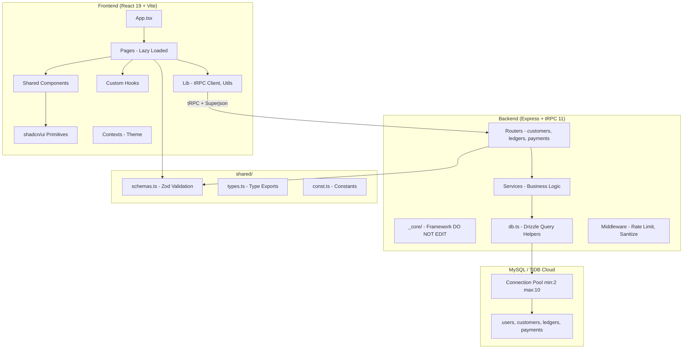
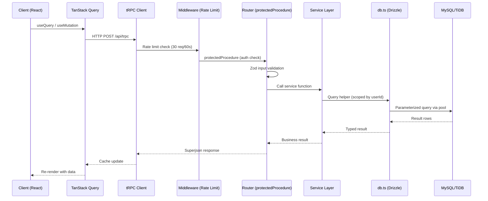
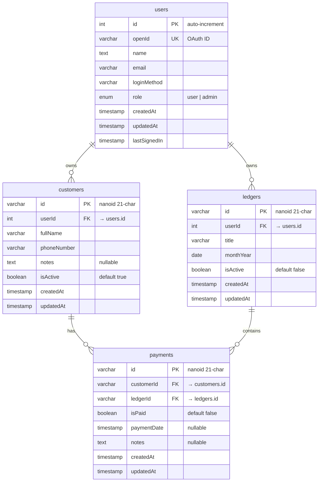
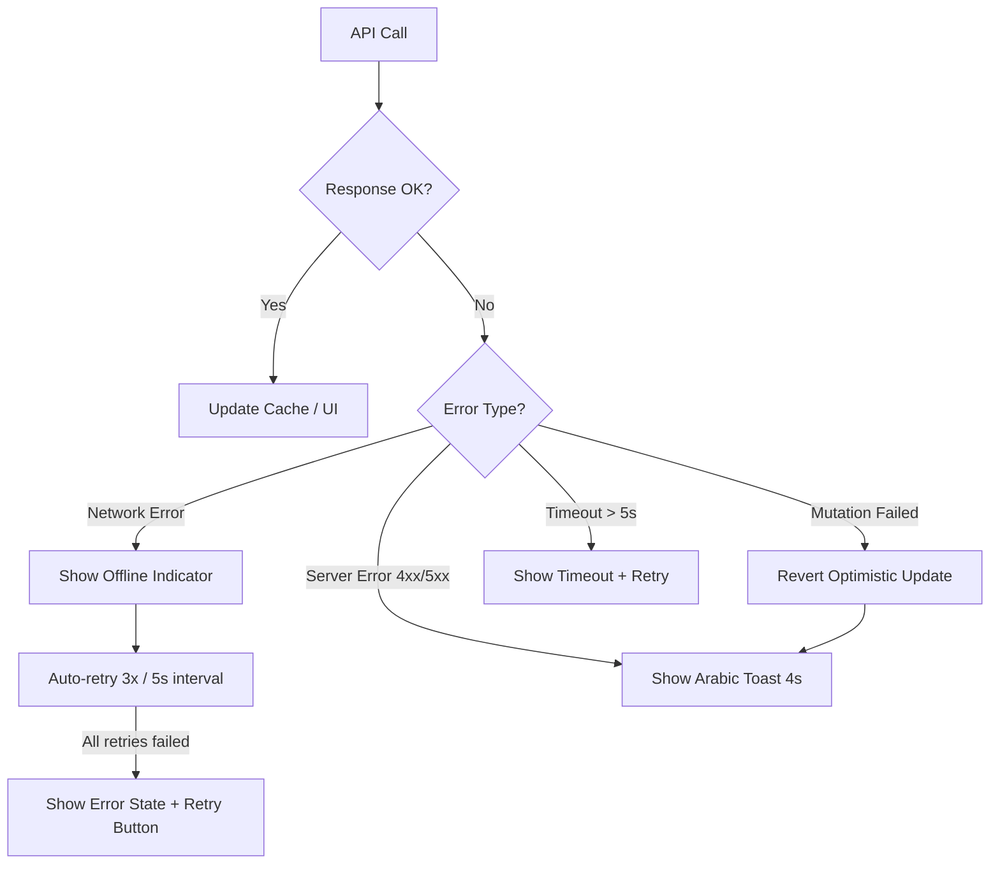

# Design Document: Project Overhaul (دفتر السداد)

## Overview

This design document defines the technical architecture and implementation approach for the comprehensive overhaul of the Payment Ledger (دفتر السداد) system. The overhaul transforms the existing codebase from a prototype with dual data layers, missing authentication, inconsistent localization, and duplicated code into a production-ready application with clean architecture, full Arabic RTL support, responsive design, and optimized performance.

### Key Design Decisions

1. **Single Data Layer (Drizzle ORM)**: Remove Supabase entirely; all database access flows through `server/db.ts` using Drizzle ORM with connection pooling and retry logic.
2. **Domain-Driven Router Split**: Break the monolithic `server/routers.ts` into per-domain routers (`customers`, `ledgers`, `payments`) with a service layer for business logic.
3. **Shared Validation Schemas**: Define Zod schemas in `shared/schemas.ts` used by both frontend forms and backend input validation.
4. **Component Extraction**: Consolidate duplicated UI patterns (loading, empty state, export buttons, create-ledger dialog) into shared components.
5. **RTL-First CSS**: Use Tailwind logical properties (`ms-`, `me-`, `ps-`, `pe-`) throughout, with `dir="rtl"` on the document root.
6. **Optimistic Updates with Rollback**: Payment status toggles update UI immediately and revert on server failure.
7. **Connection Resilience**: Exponential backoff retry on startup, auto-reconnection during operation, health check endpoint, degraded mode.

### Scope Boundaries

- `server/_core/` is **not modified** (framework infrastructure).
- All existing CRUD functionality is preserved (Requirement 18).
- The Home page is consolidated into Dashboard (single `/` route).

## Architecture

### High-Level System Architecture



### Request Flow



### Directory Structure (Post-Overhaul)

```
payment_ledger/
├── client/src/
│   ├── App.tsx                    # Lazy routes + providers
│   ├── components/
│   │   ├── ui/                    # shadcn/ui primitives (unchanged)
│   │   ├── DashboardLayout.tsx    # RTL sidebar + responsive header
│   │   ├── ErrorBoundary.tsx      # Arabic error fallback
│   │   ├── CreateLedgerDialog.tsx # Extracted reusable dialog
│   │   ├── ExportButtons.tsx      # Extracted export (Excel/CSV)
│   │   ├── LoadingState.tsx       # Skeleton loading component
│   │   ├── EmptyState.tsx         # Empty data placeholder
│   │   ├── DataTable.tsx          # Pagination + sorting + hover
│   │   ├── OfflineIndicator.tsx   # Network error banner
│   │   └── ConfirmDialog.tsx      # Confirmation dialog
│   ├── contexts/
│   │   └── ThemeContext.tsx
│   ├── hooks/
│   │   ├── useMobile.tsx
│   │   ├── usePrefetch.ts        # Navigation prefetch hook
│   │   └── useScrollRestore.ts   # Scroll position restoration
│   ├── lib/
│   │   ├── trpc.ts               # tRPC client binding
│   │   ├── formatDate.ts         # ar-SA date formatting utility
│   │   └── animations.ts         # Framer Motion presets
│   └── pages/
│       ├── Dashboard.tsx          # Combined Home + Dashboard
│       ├── customers/
│       │   ├── index.tsx          # Customers page
│       │   └── CustomerForm.tsx   # Customer form component
│       ├── ledgers/
│       │   ├── index.tsx          # Ledgers list page
│       │   └── LedgerDetail.tsx   # Ledger detail page
│       └── reports/
│           └── index.tsx          # Reports page
├── server/
│   ├── _core/                     # DO NOT EDIT
│   ├── routers/
│   │   ├── index.ts              # appRouter composition
│   │   ├── customers.ts          # Customer procedures
│   │   ├── ledgers.ts            # Ledger procedures
│   │   └── payments.ts           # Payment procedures
│   ├── services/
│   │   ├── customers.ts          # Customer business logic
│   │   ├── ledgers.ts            # Ledger business logic
│   │   └── payments.ts           # Payment business logic
│   ├── middleware/
│   │   ├── rateLimiter.ts        # IP-based rate limiting
│   │   └── sanitize.ts           # HTML strip + length limit
│   ├── db.ts                     # Drizzle query helpers (enhanced)
│   └── health.ts                 # /health endpoint
├── drizzle/
│   ├── schema.ts                 # Table definitions + constraints
│   └── relations.ts              # Drizzle ORM relations
├── shared/
│   ├── schemas.ts                # Shared Zod validation schemas
│   ├── const.ts                  # Shared constants
│   └── types.ts                  # Type re-exports
└── package.json                  # Cleaned dependencies
```

## Components and Interfaces

### Backend Components

#### 1. Router Layer (`server/routers/`)

Each domain router uses `protectedProcedure` and scopes queries by `ctx.user.id`.

```typescript
// server/routers/customers.ts
import { protectedProcedure, router } from "../_core/trpc";
import { customerCreateSchema, customerUpdateSchema } from "@shared/schemas";
import * as customerService from "../services/customers";

export const customersRouter = router({
  list: protectedProcedure.query(({ ctx }) =>
    customerService.listByUser(ctx.user.id)
  ),
  create: protectedProcedure
    .input(customerCreateSchema)
    .mutation(({ ctx, input }) =>
      customerService.create(ctx.user.id, input)
    ),
  update: protectedProcedure
    .input(customerUpdateSchema)
    .mutation(({ ctx, input }) =>
      customerService.update(ctx.user.id, input)
    ),
  delete: protectedProcedure
    .input(z.object({ id: idSchema }))
    .mutation(({ ctx, input }) =>
      customerService.remove(ctx.user.id, input.id)
    ),
  toggleActive: protectedProcedure
    .input(z.object({ id: idSchema, isActive: z.boolean() }))
    .mutation(({ ctx, input }) =>
      customerService.toggleActive(ctx.user.id, input.id, input.isActive)
    ),
});
```

#### 2. Service Layer (`server/services/`)

Services contain business logic, ownership verification, and input sanitization.

```typescript
// server/services/customers.ts
import { TRPCError } from "@trpc/server";
import * as db from "../db";
import { sanitizeString } from "../middleware/sanitize";

export async function create(userId: number, input: CustomerCreateInput) {
  const sanitized = {
    fullName: sanitizeString(input.fullName),
    phoneNumber: sanitizeString(input.phoneNumber),
    notes: input.notes ? sanitizeString(input.notes) : null,
  };
  return db.createCustomer({ ...sanitized, userId, id: nanoid() });
}

export async function remove(userId: number, customerId: string) {
  const customer = await db.getCustomerById(customerId);
  if (!customer || customer.userId !== userId) {
    throw new TRPCError({ code: "FORBIDDEN", message: "لا تملك صلاحية لهذا الإجراء" });
  }
  await db.deleteCustomer(customerId); // cascade deletes payments
}
```

#### 3. Database Layer (`server/db.ts`) — Enhanced

```typescript
// Connection with pooling and retry
import { drizzle } from "drizzle-orm/mysql2";
import mysql from "mysql2/promise";

const POOL_CONFIG = { min: 2, max: 10, idleTimeout: 60_000 };
const MAX_RETRIES = 5;
const MAX_BACKOFF_MS = 30_000;

let pool: mysql.Pool | null = null;
let connectionState: "connected" | "disconnected" | "reconnecting" = "disconnected";

export async function initializePool(): Promise<void> {
  for (let attempt = 1; attempt <= MAX_RETRIES; attempt++) {
    try {
      pool = mysql.createPool({ uri: process.env.DATABASE_URL, ...POOL_CONFIG });
      await pool.query("SELECT 1"); // verify connection
      connectionState = "connected";
      logStateChange("connected");
      return;
    } catch (error) {
      const delay = Math.min(2 ** (attempt - 1) * 1000, MAX_BACKOFF_MS);
      logStateChange("reconnecting", { attempt, delay });
      await sleep(delay);
    }
  }
  connectionState = "disconnected";
  logStateChange("disconnected");
  // Start background retry every 30s (degraded mode)
  startBackgroundRetry();
}
```

#### 4. Rate Limiter (`server/middleware/rateLimiter.ts`)

```typescript
// IP-based sliding window rate limiter
interface RateLimitEntry { count: number; resetAt: number; }
const store = new Map<string, RateLimitEntry>();

export function checkRateLimit(ip: string): { allowed: boolean; retryAfter?: number } {
  const now = Date.now();
  const entry = store.get(ip);
  if (!entry || now > entry.resetAt) {
    store.set(ip, { count: 1, resetAt: now + 60_000 });
    return { allowed: true };
  }
  if (entry.count >= 30) {
    return { allowed: false, retryAfter: Math.ceil((entry.resetAt - now) / 1000) };
  }
  entry.count++;
  return { allowed: true };
}
```

#### 5. Input Sanitizer (`server/middleware/sanitize.ts`)

```typescript
const HTML_TAG_REGEX = /<[^>]*>/g;
const MAX_STRING_LENGTH = 1000;

export function sanitizeString(input: string): string {
  return input.replace(HTML_TAG_REGEX, "").slice(0, MAX_STRING_LENGTH);
}
```

#### 6. Health Check (`server/health.ts`)

```typescript
// GET /health — lightweight DB ping
export async function healthCheck(): Promise<{ status: "connected" | "disconnected" }> {
  try {
    const db = await getDb();
    if (!db) return { status: "disconnected" };
    await db.execute(sql`SELECT 1`);
    return { status: "connected" };
  } catch {
    return { status: "disconnected" };
  }
}
```

### Frontend Components

#### 1. DataTable Component

Generic table with pagination, sorting, hover, alternating rows, and count summary.

```typescript
interface DataTableProps<T> {
  data: T[];
  columns: ColumnDef<T>[];
  pageSize?: number;          // default 20
  searchFilter?: (item: T, query: string) => boolean;
  emptyState?: { message: string; actionLabel: string; onAction: () => void };
  sortableColumns?: (keyof T)[];
}
```

#### 2. CreateLedgerDialog Component

Extracted from Dashboard and Ledgers pages.

```typescript
interface CreateLedgerDialogProps {
  open: boolean;
  onOpenChange: (open: boolean) => void;
  onSuccess?: () => void;
}
```

#### 3. ExportButtons Component

```typescript
interface ExportButtonsProps {
  data: Record<string, unknown>[];
  filename: string;
  formats?: ("excel" | "csv" | "pdf")[];
}
```

#### 4. LoadingState / EmptyState Components

```typescript
interface LoadingStateProps { message?: string; }
interface EmptyStateProps {
  message: string;
  actionLabel?: string;
  onAction?: () => void;
  icon?: LucideIcon;
}
```

#### 5. OfflineIndicator Component

Displays when network is unavailable, auto-retries failed requests.

```typescript
// Renders a fixed banner at top of viewport when offline
// Integrates with TanStack Query's onlineManager
```


### Shared Schemas (`shared/schemas.ts`)

```typescript
import { z } from "zod";

// ID validation: 21-char nanoid (alphanumeric + hyphen + underscore)
export const idSchema = z.string().regex(
  /^[a-zA-Z0-9_-]{21}$/,
  "معرّف غير صالح"
);

export const customerCreateSchema = z.object({
  fullName: z.string().min(1, "الاسم مطلوب").max(1000),
  phoneNumber: z.string()
    .min(1, "رقم الجوال مطلوب")
    .refine(
      (val) => val.replace(/\D/g, "").length >= 10,
      "رقم الجوال يجب أن يحتوي على 10 أرقام على الأقل"
    ),
  notes: z.string().max(1000).optional(),
});

export const customerUpdateSchema = z.object({
  id: idSchema,
  fullName: z.string().min(1).max(1000).optional(),
  phoneNumber: z.string()
    .refine(
      (val) => val.replace(/\D/g, "").length >= 10,
      "رقم الجوال يجب أن يحتوي على 10 أرقام على الأقل"
    )
    .optional(),
  notes: z.string().max(1000).optional(),
  isActive: z.boolean().optional(),
});

export const ledgerCreateSchema = z.object({
  title: z.string().min(1, "عنوان الدفتر مطلوب").max(1000),
  monthYear: z.date(),
});

export const ledgerUpdateSchema = z.object({
  id: idSchema,
  title: z.string().min(1).max(1000).optional(),
  isActive: z.boolean().optional(),
});

export const paymentUpdateSchema = z.object({
  id: idSchema,
  isPaid: z.boolean().optional(),
  paymentDate: z.date().nullable().optional(),
  notes: z.string().max(1000).nullable().optional(),
});
```

### Animation Presets (`client/src/lib/animations.ts`)

```typescript
import { Variants } from "framer-motion";

export const pageTransition = {
  initial: { opacity: 0, y: 10 },
  animate: { opacity: 1, y: 0 },
  exit: { opacity: 0, y: -10 },
  transition: { duration: 0.3, ease: "easeOut" },
};

export const staggerContainer: Variants = {
  hidden: {},
  show: { transition: { staggerChildren: 0.05 } },
};

export const staggerItem: Variants = {
  hidden: { opacity: 0, y: 10 },
  show: { opacity: 1, y: 0, transition: { duration: 0.3 } },
};

export const cardHover = {
  whileHover: { scale: 1.02, boxShadow: "0 4px 12px rgba(0,0,0,0.1)" },
  transition: { duration: 0.2 },
};

export const dialogAnimation = {
  initial: { scale: 0.95, opacity: 0 },
  animate: { scale: 1, opacity: 1, transition: { duration: 0.2 } },
  exit: { scale: 0.95, opacity: 0, transition: { duration: 0.15 } },
};

// Respects prefers-reduced-motion
export const reducedMotion = {
  initial: { opacity: 0 },
  animate: { opacity: 1, transition: { duration: 0.1 } },
};
```

### Date Formatting Utility (`client/src/lib/formatDate.ts`)

```typescript
export function formatDate(date: Date | string | null | undefined): string {
  if (!date) return "—";
  const d = typeof date === "string" ? new Date(date) : date;
  if (isNaN(d.getTime())) return "—";
  return d.toLocaleDateString("ar-SA", {
    year: "numeric",
    month: "long",
    day: "numeric",
  });
}
```

## Data Models

### Entity Relationship Diagram



### Drizzle Relations Definition (`drizzle/relations.ts`)

```typescript
import { relations } from "drizzle-orm";
import { users, customers, ledgers, payments } from "./schema";

export const usersRelations = relations(users, ({ many }) => ({
  customers: many(customers),
  ledgers: many(ledgers),
}));

export const customersRelations = relations(customers, ({ one, many }) => ({
  user: one(users, { fields: [customers.userId], references: [users.id] }),
  payments: many(payments),
}));

export const ledgersRelations = relations(ledgers, ({ one, many }) => ({
  user: one(users, { fields: [ledgers.userId], references: [users.id] }),
  payments: many(payments),
}));

export const paymentsRelations = relations(payments, ({ one }) => ({
  customer: one(customers, { fields: [payments.customerId], references: [customers.id] }),
  ledger: one(ledgers, { fields: [payments.ledgerId], references: [ledgers.id] }),
}));
```

### Schema Constraints (additions to `drizzle/schema.ts`)

```typescript
// Add to payments table definition:
import { uniqueIndex } from "drizzle-orm/mysql-core";

export const payments = mysqlTable("payments", {
  // ... existing columns ...
}, (table) => ({
  uniqueCustomerLedger: uniqueIndex("unique_customer_ledger")
    .on(table.customerId, table.ledgerId),
}));

// Foreign key constraints enforced via SQL migration:
// ALTER TABLE customers ADD CONSTRAINT fk_customers_user
//   FOREIGN KEY (userId) REFERENCES users(id);
// ALTER TABLE ledgers ADD CONSTRAINT fk_ledgers_user
//   FOREIGN KEY (userId) REFERENCES users(id);
// ALTER TABLE payments ADD CONSTRAINT fk_payments_customer
//   FOREIGN KEY (customerId) REFERENCES customers(id) ON DELETE CASCADE;
// ALTER TABLE payments ADD CONSTRAINT fk_payments_ledger
//   FOREIGN KEY (ledgerId) REFERENCES ledgers(id) ON DELETE CASCADE;
```

### TanStack Query Configuration

```typescript
const queryClient = new QueryClient({
  defaultOptions: {
    queries: {
      staleTime: 30_000,    // 30 seconds
      gcTime: 300_000,      // 5 minutes
      retry: 3,
      retryDelay: (attempt) => Math.min(1000 * 2 ** attempt, 5000),
    },
    mutations: {
      retry: 0, // mutations don't auto-retry
    },
  },
});
```

## Correctness Properties

*A property is a characteristic or behavior that should hold true across all valid executions of a system — essentially, a formal statement about what the system should do. Properties serve as the bridge between human-readable specifications and machine-verifiable correctness guarantees.*

### Property 1: Database Error Response Structure

*For any* database operation that fails (connection timeout, query error, unavailable), the returned error response SHALL contain an `error: true` flag and a non-empty `message` string describing the failure reason.

**Validates: Requirements 1.5**

### Property 2: Authentication Enforcement

*For any* tRPC procedure in the customers, ledgers, or payments routers, calling it without a valid authenticated session SHALL return a 401 error with the message defined in `UNAUTHED_ERR_MSG`.

**Validates: Requirements 2.2**

### Property 3: User Data Isolation

*For any* authenticated user and any query to customers, ledgers, or payments routers, all returned records SHALL belong exclusively to that user (customers/ledgers by `userId`, payments by their parent ledger's `userId`).

**Validates: Requirements 2.3, 2.4, 2.5, 2.6**

### Property 4: Ownership Enforcement on Mutations

*For any* update or delete mutation targeting a resource (customer, ledger, or payment) not owned by the authenticated user, the system SHALL reject the operation with a 403 error.

**Validates: Requirements 2.7**

### Property 5: Arabic Validation Messages

*For any* form field with any invalid input value, the displayed validation error message SHALL be a non-empty string containing Arabic characters (Unicode range \u0600-\u06FF).

**Validates: Requirements 3.5, 7.1**

### Property 6: Date Formatting ar-SA Locale

*For any* valid Date object, the `formatDate` utility SHALL produce a string containing Arabic script characters representing day, month name, and year in the ar-SA locale format.

**Validates: Requirements 3.6, 6.6**

### Property 7: Phone Number Validation

*For any* string where the count of digit characters (after removing non-digit characters) is less than 10, the phone number validation SHALL reject the input with an Arabic error message.

**Validates: Requirements 7.2**

### Property 8: Table Pagination Invariant

*For any* dataset with N items where N > 20, the DataTable component SHALL display exactly `min(20, remaining)` items per page and render pagination controls.

**Validates: Requirements 11.1**

### Property 9: Column Sorting Correctness

*For any* list of items and any sortable column, after sorting in ascending order, each item's sort-key value SHALL be less than or equal to the next item's sort-key value.

**Validates: Requirements 11.2**

### Property 10: Count Summary Invariant

*For any* dataset with total items T, after applying a filter that matches F items, and displaying page P with D items: D ≤ F ≤ T, and D equals `min(pageSize, F - (page - 1) * pageSize)`.

**Validates: Requirements 11.5**

### Property 11: Null Field Rendering

*For any* record where `paymentDate` or `notes` is null, the rendered output SHALL contain the placeholder "—" and SHALL NOT contain the strings "null" or "undefined".

**Validates: Requirements 12.6**

### Property 12: Input Sanitization

*For any* string input containing HTML tags, after sanitization the stored value SHALL contain zero `<` or `>` characters from HTML tags. *For any* string longer than 1000 characters, the stored value SHALL have length ≤ 1000.

**Validates: Requirements 13.2**

### Property 13: ID Format Validation

*For any* string input used as an entity ID, the validation SHALL accept it if and only if it matches the pattern `^[a-zA-Z0-9_-]{21}$`. Invalid IDs SHALL produce a 400 error without executing a database query.

**Validates: Requirements 13.4, 13.6**

### Property 14: Cascade Deletion Integrity

*For any* customer (or ledger) with N associated payment records, after deleting that customer (or ledger), the count of payments referencing the deleted entity's ID SHALL be zero.

**Validates: Requirements 14.5, 14.6**

### Property 15: Payment Uniqueness Constraint

*For any* (customerId, ledgerId) pair that already exists in the payments table, attempting to insert a duplicate record with the same pair SHALL fail with a constraint violation error.

**Validates: Requirements 14.8**

### Property 16: Optimistic Update Revert

*For any* payment status toggle where the server mutation fails, the UI-displayed payment status SHALL revert to its original value (the value before the toggle was initiated).

**Validates: Requirements 16.3**

### Property 17: Exponential Backoff Timing

*For any* retry attempt number N (1 through 5), the delay before that attempt SHALL equal `min(2^(N-1) * 1000, 30000)` milliseconds.

**Validates: Requirements 19.1**


## Error Handling

### Backend Error Strategy

| Error Type | HTTP Status | Response Shape | User Message |
|---|---|---|---|
| Zod validation failure | 400 | `{ code: "BAD_REQUEST", message }` | Arabic field-specific message from schema |
| Invalid ID format | 400 | `{ code: "BAD_REQUEST", message }` | "معرّف غير صالح" |
| Unauthenticated | 401 | `{ code: "UNAUTHORIZED", message }` | `UNAUTHED_ERR_MSG` |
| Ownership violation | 403 | `{ code: "FORBIDDEN", message }` | "لا تملك صلاحية لهذا الإجراء" |
| Rate limit exceeded | 429 | `{ code: "TOO_MANY_REQUESTS", message }` + `Retry-After` header | "تم تجاوز الحد المسموح، حاول بعد X ثانية" |
| Database unavailable | 503 | `{ code: "SERVICE_UNAVAILABLE", message }` | "الخدمة غير متاحة حالياً، حاول لاحقاً" |
| Internal error | 500 | `{ code: "INTERNAL_SERVER_ERROR", message }` | "حدث خطأ غير متوقع" |

### Frontend Error Handling Layers



### Error Boundary

```typescript
// Arabic error boundary fallback
function ErrorFallback() {
  return (
    <div dir="rtl" className="flex flex-col items-center justify-center min-h-screen gap-4">
      <AlertCircle className="w-16 h-16 text-destructive" />
      <h1 className="text-2xl font-bold">حدث خطأ غير متوقع</h1>
      <p className="text-muted-foreground">نعتذر عن هذا الخطأ، يرجى إعادة تحميل الصفحة</p>
      <Button onClick={() => window.location.reload()}>إعادة تحميل</Button>
    </div>
  );
}
```

### Optimistic Updates Pattern

```typescript
// Payment toggle with optimistic update and rollback
const togglePayment = trpc.payments.update.useMutation({
  onMutate: async ({ id, isPaid }) => {
    await queryClient.cancelQueries({ queryKey: ["payments"] });
    const previous = queryClient.getQueryData(["payments", ledgerId]);
    queryClient.setQueryData(["payments", ledgerId], (old) =>
      old?.map((p) => p.id === id ? { ...p, isPaid, paymentDate: isPaid ? new Date() : null } : p)
    );
    return { previous };
  },
  onError: (_err, _vars, context) => {
    queryClient.setQueryData(["payments", ledgerId], context?.previous);
    toast.error("فشل تحديث حالة الدفع، تم التراجع عن التغيير");
  },
  onSettled: () => {
    queryClient.invalidateQueries({ queryKey: ["payments", ledgerId] });
  },
});
```

### Connection Resilience

```typescript
// Database connection state machine
type ConnectionState = "connected" | "disconnected" | "reconnecting";

// State transitions logged with timestamps:
// disconnected → reconnecting (on retry attempt)
// reconnecting → connected (on successful connection)
// reconnecting → disconnected (after max retries exhausted)
// connected → reconnecting (on connection lost during operation)

function logStateChange(newState: ConnectionState, meta?: Record<string, unknown>) {
  console.log(`[DB] ${new Date().toISOString()} State: ${newState}`, meta ?? "");
}
```

## Testing Strategy

### Testing Approach

This overhaul uses a **dual testing approach**:

1. **Property-based tests** (Vitest + fast-check): Verify universal correctness properties across randomized inputs. Each property test runs a minimum of 100 iterations.
2. **Unit/Integration tests** (Vitest): Verify specific examples, edge cases, integration points, and UI behavior.

### Property-Based Testing Configuration

- **Library**: `fast-check` with Vitest
- **Minimum iterations**: 100 per property
- **Tag format**: `Feature: project-overhaul, Property {N}: {title}`
- **Location**: `server/*.property.test.ts` for backend, `client/src/**/*.property.test.ts` for frontend

### Test Categories by Requirement

| Requirement | Test Type | Key Tests |
|---|---|---|
| 1. Unified Data Layer | SMOKE + PROPERTY | No supabase imports; error response structure (P1) |
| 2. Authentication | PROPERTY | Auth enforcement (P2); data isolation (P3); ownership (P4) |
| 3. Arabic Localization | PROPERTY + EXAMPLE | Validation messages (P5); date format (P6) |
| 4. RTL Layout | EXAMPLE | Snapshot tests for layout direction |
| 5. Responsive Design | EXAMPLE | Viewport-based rendering tests |
| 6. Code Deduplication | SMOKE | Single import verification |
| 7. Form Validation | PROPERTY | Phone validation (P7); Arabic errors (P5) |
| 8. Performance | SMOKE + INTEGRATION | Query config values; lazy loading verification |
| 9. Animations | EXAMPLE | Reduced-motion media query test |
| 10. Navigation | EXAMPLE | Active state, breadcrumb, keyboard nav tests |
| 11. Tables | PROPERTY | Pagination (P8); sorting (P9); counts (P10) |
| 12. Type Safety | SMOKE + PROPERTY | Zero TS errors; null rendering (P11) |
| 13. Security | PROPERTY | Sanitization (P12); ID validation (P13) |
| 14. DB Relations | PROPERTY + INTEGRATION | Cascade delete (P14); uniqueness (P15) |
| 15. Cleanup | SMOKE | Successful build after removals |
| 16. Error Handling | PROPERTY + EXAMPLE | Optimistic revert (P16); retry behavior |
| 17. Architecture | SMOKE | File structure verification |
| 18. Preserve Functionality | INTEGRATION | End-to-end CRUD workflows |
| 19. Connection Reliability | PROPERTY + INTEGRATION | Backoff timing (P17); health check |
| 20. UI Polish | EXAMPLE | Spacing, contrast, focus ring tests |

### Property Test Examples

```typescript
// server/services/sanitize.property.test.ts
import { describe, it, expect } from "vitest";
import { fc } from "@fast-check/vitest";
import { sanitizeString } from "../middleware/sanitize";

describe("Feature: project-overhaul, Property 12: Input Sanitization", () => {
  it("strips all HTML tags from any input string", () => {
    fc.assert(
      fc.property(fc.string(), (input) => {
        const result = sanitizeString(input);
        expect(result).not.toMatch(/<[^>]*>/);
      }),
      { numRuns: 100 }
    );
  });

  it("truncates any string to max 1000 characters", () => {
    fc.assert(
      fc.property(fc.string({ minLength: 1001, maxLength: 5000 }), (input) => {
        const result = sanitizeString(input);
        expect(result.length).toBeLessThanOrEqual(1000);
      }),
      { numRuns: 100 }
    );
  });
});
```

```typescript
// server/services/id-validation.property.test.ts
import { describe, it, expect } from "vitest";
import { fc } from "@fast-check/vitest";
import { idSchema } from "@shared/schemas";

describe("Feature: project-overhaul, Property 13: ID Format Validation", () => {
  it("accepts valid 21-char nanoid strings", () => {
    const nanoidArb = fc.stringOf(
      fc.constantFrom(..."abcdefghijklmnopqrstuvwxyzABCDEFGHIJKLMNOPQRSTUVWXYZ0123456789_-".split("")),
      { minLength: 21, maxLength: 21 }
    );
    fc.assert(
      fc.property(nanoidArb, (id) => {
        expect(idSchema.safeParse(id).success).toBe(true);
      }),
      { numRuns: 100 }
    );
  });

  it("rejects strings that don't match the 21-char pattern", () => {
    const invalidArb = fc.oneof(
      fc.string({ minLength: 0, maxLength: 20 }),  // too short
      fc.string({ minLength: 22, maxLength: 50 }), // too long
      fc.constant("abc!@#$%^&*()_-abcdef"),        // invalid chars
    );
    fc.assert(
      fc.property(invalidArb, (id) => {
        expect(idSchema.safeParse(id).success).toBe(false);
      }),
      { numRuns: 100 }
    );
  });
});
```

```typescript
// server/db.property.test.ts
describe("Feature: project-overhaul, Property 17: Exponential Backoff Timing", () => {
  it("computes correct delay for any attempt number 1-5", () => {
    fc.assert(
      fc.property(fc.integer({ min: 1, max: 5 }), (attempt) => {
        const expected = Math.min(2 ** (attempt - 1) * 1000, 30_000);
        const actual = computeBackoffDelay(attempt);
        expect(actual).toBe(expected);
      }),
      { numRuns: 100 }
    );
  });
});
```

### Unit Test Examples

```typescript
// server/routers/customers.test.ts
describe("Customers Router", () => {
  it("returns 401 for unauthenticated list request", async () => { /* ... */ });
  it("scopes customer list to authenticated user", async () => { /* ... */ });
  it("returns 403 when deleting another user's customer", async () => { /* ... */ });
});
```

### Integration Test Examples

```typescript
// server/health.test.ts
describe("/health endpoint", () => {
  it("returns connected status when DB is available", async () => { /* ... */ });
  it("returns disconnected status when DB is unavailable", async () => { /* ... */ });
  it("responds within 5 seconds", async () => { /* ... */ });
});
```

### Dependencies to Add

```json
{
  "devDependencies": {
    "@fast-check/vitest": "^0.1.0",
    "fast-check": "^3.22.0"
  }
}
```

### Dependencies to Remove

```json
{
  "dependencies": {
    "@supabase/supabase-js": "REMOVE",
    "next-themes": "REMOVE"
  },
  "devDependencies": {
    "vite-plugin-manus-runtime": "REMOVE"
  }
}
```
