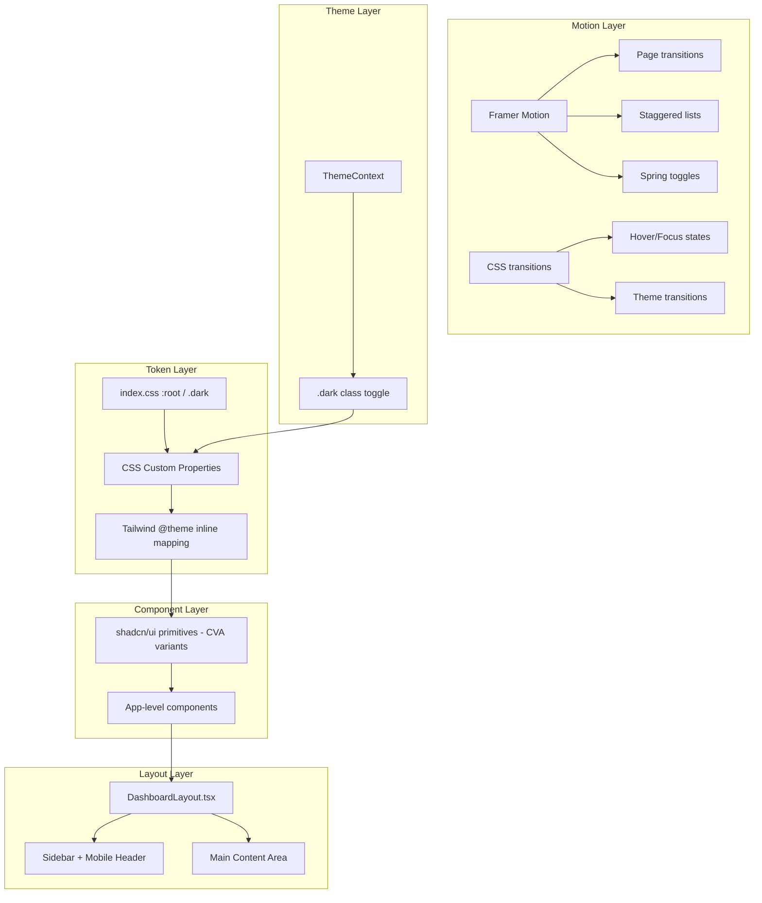

# Design Document: UI Redesign

## Overview

This design covers the comprehensive visual overhaul of the "دفتر السداد" application. The redesign enhances all UI primitives (buttons, inputs, cards, dialogs, alerts, tables), the layout shell (sidebar, responsive grid), the design token system (colors, typography, spacing, shadows, motion), and the theme system (light/dark with smooth transitions).

The approach builds on the existing architecture:
- **CSS custom properties** in `client/src/index.css` define the token layer
- **shadcn/ui components** in `client/src/components/ui/` consume tokens via Tailwind CSS 4 and CVA
- **Framer Motion** handles complex animations (page transitions, staggered lists, spring toggles)
- **CSS transitions** handle simple state changes (hover, focus, theme switch)
- **DashboardLayout.tsx** owns the sidebar, mobile header, and content shell

All changes are purely visual — no backend, routing, or data model changes are required.

### Design Decisions

| Decision | Rationale |
|----------|-----------|
| oklch color space | Already in use; provides perceptually uniform lightness for accessible contrast |
| CSS logical properties | Enables native RTL without direction-specific overrides |
| CVA variants over utility-only | Keeps component APIs stable while changing visuals |
| Framer Motion for orchestrated animations | Already a dependency; spring physics and stagger are built-in |
| CSS transitions for micro-interactions | Lower overhead than JS for hover/focus/theme changes |
| Token-first approach | Change tokens → all components update; avoids scattered magic values |

---

## Architecture



### File Change Map

| File/Directory | Change Type | Purpose |
|---|---|---|
| `client/src/index.css` | Modify | Expand token system (colors, shadows, spacing, motion tokens) |
| `client/src/components/ui/button.tsx` | Modify | Add gradient variant, press/hover/focus effects via CVA |
| `client/src/components/ui/input.tsx` | Modify | Enhanced focus ring, invalid state, RTL logical properties |
| `client/src/components/ui/card.tsx` | Modify | Glass effect, hover lift, gradient accent bar |
| `client/src/components/ui/dialog.tsx` | Modify | Scale-fade animation, RTL close button, focus trap |
| `client/src/components/ui/alert.tsx` | Modify | Severity-colored borders, tinted backgrounds |
| `client/src/components/DataTable.tsx` | Modify | Alternating rows, responsive card layout, status badges |
| `client/src/components/EmptyState.tsx` | Modify | Centered layout with icon, message, action |
| `client/src/components/LoadingState.tsx` | Modify | RTL-aware shimmer, reduced-motion support |
| `client/src/components/LoadingSpinner.tsx` | Modify | Size variants, aria attributes, reduced-motion |
| `client/src/components/DashboardLayout.tsx` | Modify | Glass sidebar, active glow, mobile header, resize handle |
| `client/src/components/ThemeToggle.tsx` | Modify | Rotation/scale animation on toggle |
| `client/src/components/EnhancedToast.tsx` | Modify | Slide-in from top-start, severity accent border |
| `client/src/components/ConfirmDialog.tsx` | Modify | Variant-colored accent, animation |
| `client/src/contexts/ThemeContext.tsx` | Modify | Ensure <100ms restore, prevent flash |
| `client/src/hooks/useReducedMotion.ts` | Create | Hook for `prefers-reduced-motion` media query |
| `client/src/hooks/useStaggerAnimation.ts` | Create | Hook for staggered entrance animations |
| `client/src/hooks/useCountUp.ts` | Create | Hook for animated number counting |
| `client/src/lib/motion.ts` | Create | Shared Framer Motion variants and transition presets |

---

## Components and Interfaces

### 1. Design Token System (`index.css`)

The token system expands the existing CSS custom properties:

```css
/* New tokens added to :root */
:root {
  /* Semantic colors (existing, refined) */
  --success: oklch(...);
  --success-foreground: oklch(...);
  --warning: oklch(...);
  --warning-foreground: oklch(...);
  --info: oklch(...);
  --info-foreground: oklch(...);

  /* Shadow tokens */
  --shadow-xs: 0 1px 2px oklch(0 0 0 / 0.04);
  --shadow-sm: 0 2px 4px oklch(0 0 0 / 0.06);
  --shadow-md: 0 4px 12px oklch(0 0 0 / 0.08);
  --shadow-lg: 0 8px 24px oklch(0 0 0 / 0.10);
  --shadow-xl: 0 16px 48px oklch(0 0 0 / 0.12);
  --shadow-glow: 0 0 20px oklch(0.55 0.22 264 / 0.2);

  /* Transition tokens */
  --duration-fast: 150ms;
  --duration-normal: 200ms;
  --duration-slow: 300ms;
  --duration-smooth: 500ms;
  --ease-out: cubic-bezier(0.16, 1, 0.3, 1);
  --ease-in-out: cubic-bezier(0.45, 0, 0.55, 1);

  /* Spacing (4px base) */
  --space-0-5: 2px;
  --space-1: 4px;
  --space-2: 8px;
  --space-3: 12px;
  --space-4: 16px;
  --space-5: 20px;
  --space-6: 24px;
  --space-8: 32px;
  --space-10: 40px;
  --space-12: 48px;
  --space-16: 64px;

  /* Border radius */
  --radius-sm: 6px;
  --radius-md: 8px;
  --radius-lg: 12px;
  --radius-xl: 16px;
  --radius-2xl: 20px;
  --radius-full: 9999px;
}
```

### 2. Button Component Interface

```typescript
// Existing CVA variants extended
const buttonVariants = cva(baseClasses, {
  variants: {
    variant: {
      default: "...",       // Gradient background
      destructive: "...",   // Red with hover darken
      outline: "...",       // Border + transparent bg
      secondary: "...",     // Muted bg
      ghost: "...",         // No bg, accent on hover
      link: "...",          // Underline on hover
    },
    size: {
      default: "h-9 px-4",   // 36px height
      sm: "h-8 px-3",        // 32px height
      lg: "h-10 px-6",       // 40px height
      icon: "size-9 rounded-full",      // 36px circle
      "icon-sm": "size-8 rounded-full", // 32px circle
      "icon-lg": "size-10 rounded-full", // 40px circle
    },
  },
});
```

Interactive states applied via base classes:
- Hover: `translateY(-1px)` + shadow elevation (200ms ease-out)
- Press: `scale(0.97)` (100ms)
- Focus: `ring-[3px] ring-ring/50 ring-offset-2`
- Disabled: `opacity-50 pointer-events-none`

### 3. Motion Presets (`lib/motion.ts`)

```typescript
import { type Variants, type Transition } from "framer-motion";

export const pageTransition: Variants = {
  initial: { opacity: 0, y: 10 },
  animate: { opacity: 1, y: 0 },
  exit: { opacity: 0, y: -10 },
};

export const pageTransitionConfig: Transition = {
  duration: 0.4,
  ease: [0.16, 1, 0.3, 1],
};

export const staggerContainer: Variants = {
  animate: {
    transition: { staggerChildren: 0.05, delayChildren: 0.1 },
  },
};

export const staggerItem: Variants = {
  initial: { opacity: 0, y: 8 },
  animate: { opacity: 1, y: 0, transition: { duration: 0.3, ease: "easeOut" } },
};

export const dialogVariants: Variants = {
  initial: { opacity: 0, scale: 0.95 },
  animate: { opacity: 1, scale: 1, transition: { duration: 0.2, ease: "easeOut" } },
  exit: { opacity: 0, scale: 0.95, transition: { duration: 0.15, ease: "easeIn" } },
};

export const springToggle: Transition = {
  type: "spring",
  stiffness: 300,
  damping: 20,
};
```

### 4. Hooks Interface

```typescript
// useReducedMotion.ts
export function useReducedMotion(): boolean;

// useStaggerAnimation.ts
export function useStaggerAnimation(itemCount: number, maxStagger?: number): {
  containerVariants: Variants;
  itemVariants: Variants;
};

// useCountUp.ts
export function useCountUp(target: number, duration?: number): number;
```

### 5. Layout Shell Updates

The `DashboardLayout` component gains:
- Glass sidebar with `backdrop-filter: blur(20px)` and translucent background
- Active nav item: gradient background + glow shadow + white text
- Collapsed state: icon-only with tooltips (300ms delay)
- Mobile header: sticky, 64px, glass background, hamburger + title + theme toggle
- Resize handle: gradient indicator on hover, col-resize cursor
- Responsive content padding: 16px (mobile) → 24px (tablet) → 32px (laptop) → 40px (desktop)
- Dashboard grid: 1-col (mobile) → 2-col (tablet) → 3-col (laptop) → 4-col (desktop)

### 6. Theme System Updates

The `ThemeContext` is enhanced to:
- Read localStorage synchronously before first render (prevent flash)
- Apply `.dark` class within 100ms of initial render
- Default to light theme when no preference is stored
- CSS transitions on `html` element cover `background-color`, `color`, `border-color`, `box-shadow` over 300ms

---

## Data Models

This feature introduces no new data models or database changes. All state is visual:

| State | Storage | Scope |
|-------|---------|-------|
| Theme preference | `localStorage("theme")` | Per-device |
| Sidebar width | `localStorage("sidebar-width")` | Per-device |
| Sidebar collapsed | shadcn SidebarProvider state | Session |
| Reduced motion | `prefers-reduced-motion` media query | OS-level |

---

## Error Handling

| Scenario | Handling |
|----------|----------|
| CSS custom property not supported | Fallback values in oklch() degrade gracefully in older browsers; Tailwind generates fallbacks |
| `backdrop-filter` not supported | Glass effects degrade to solid backgrounds (opacity 0.95) |
| `prefers-reduced-motion` not detected | Default to animations enabled |
| localStorage unavailable (private browsing) | Catch errors in ThemeContext and sidebar width; use defaults |
| Font loading failure (Cairo/Tajawal) | System Arabic font stack fallback: `-apple-system, 'Segoe UI', sans-serif` |
| Framer Motion hydration mismatch | Use `LazyMotion` with `domAnimation` feature bundle for SSR safety |
| Sidebar width out of bounds | Clamp to MIN_WIDTH/MAX_WIDTH on read from localStorage |

---

## Correctness Properties

This feature is primarily a UI rendering and visual design overhaul. Most acceptance criteria describe visual states best verified through visual regression and accessibility testing. The following properties cover the few testable invariants:

### Property 1: Theme Persistence Roundtrip

For any theme value T in {light, dark}, storing T to localStorage and reading it back SHALL return T, and the ThemeContext SHALL apply the corresponding class within 100ms of initialization.

**Validates: Requirements 13.7, 13.8**

### Property 2: Reduced Motion Compliance

For any animation variant V in the Motion_System, IF prefers-reduced-motion is enabled, THEN the computed animation duration SHALL be ≤ 1ms and no transform-based properties (translate, scale, rotate) SHALL be applied.

**Validates: Requirements 12.4, 9.6**

### Property 3: Token Contrast Compliance

For every semantic color pair (foreground, background) defined in the Design_System, the computed contrast ratio SHALL be ≥ 4.5:1 for normal text sizes and ≥ 3:1 for large text sizes per WCAG 2.1 AA.

**Validates: Requirements 1.1, 13.2, 13.3**

---

## Testing Strategy

### Why Property-Based Testing Does Not Apply

This feature is purely a **UI rendering and visual design** overhaul. It involves:
- CSS custom properties and design tokens (declarative configuration)
- Component styling via Tailwind/CVA classes (visual output)
- Animations and transitions (temporal visual effects)
- Theme switching (class toggle + CSS variables)
- Responsive layout (CSS Grid/Flexbox breakpoints)

There are no pure functions with meaningful input variation, no data transformations, no parsers or serializers, and no business logic. The acceptance criteria describe visual states and transitions that are best verified through visual regression testing and example-based tests, not property-based testing.

### Testing Approach

**1. Visual Regression Tests (Primary)**
- Use Playwright or Storybook + Chromatic for screenshot comparison
- Capture each component in all variants × both themes × key breakpoints
- Detect unintended visual regressions on token or component changes

**2. Example-Based Unit Tests (Vitest + Testing Library)**
- Verify CVA variant classes are applied correctly for each button/input/card variant
- Verify ThemeContext persists and restores theme correctly
- Verify `useReducedMotion` returns correct value based on media query
- Verify `useCountUp` interpolates from 0 to target value
- Verify responsive breakpoint logic in layout components

**3. Accessibility Tests**
- Use `axe-core` via `@axe-core/react` or Playwright accessibility audits
- Verify contrast ratios meet WCAG 2.1 AA (4.5:1 text, 3:1 non-text)
- Verify focus indicators are visible (3:1 contrast against adjacent colors)
- Verify `aria-label` on loading spinners and skeletons
- Verify focus trap in dialogs
- Verify keyboard navigation through sidebar items

**4. Responsive Layout Tests**
- Playwright viewport tests at 375px, 768px, 1024px, 1440px, 1920px
- Verify sidebar visibility, grid column count, content padding at each breakpoint
- Verify mobile header appears/disappears at 768px boundary

**5. RTL Layout Tests**
- Verify no physical directional properties (`margin-left`, `padding-right`) in component output
- Verify sidebar renders at inline-end (right side in RTL)
- Verify directional icons are mirrored (arrows, chevrons)
- Verify text truncation shows beginning of string from right

**6. Animation Tests**
- Verify `prefers-reduced-motion: reduce` disables transform animations
- Verify stagger animation caps at 20 items
- Verify page transition cancellation on rapid navigation

### Test File Locations

| Test | Location |
|------|----------|
| Component unit tests | `client/src/components/ui/__tests__/*.test.tsx` |
| Hook tests | `client/src/hooks/__tests__/*.test.ts` |
| Theme context tests | `client/src/contexts/__tests__/ThemeContext.test.tsx` |
| Visual regression | `tests/visual/*.spec.ts` (Playwright) |
| Accessibility | `tests/a11y/*.spec.ts` (Playwright + axe) |
| Responsive | `tests/responsive/*.spec.ts` (Playwright) |
